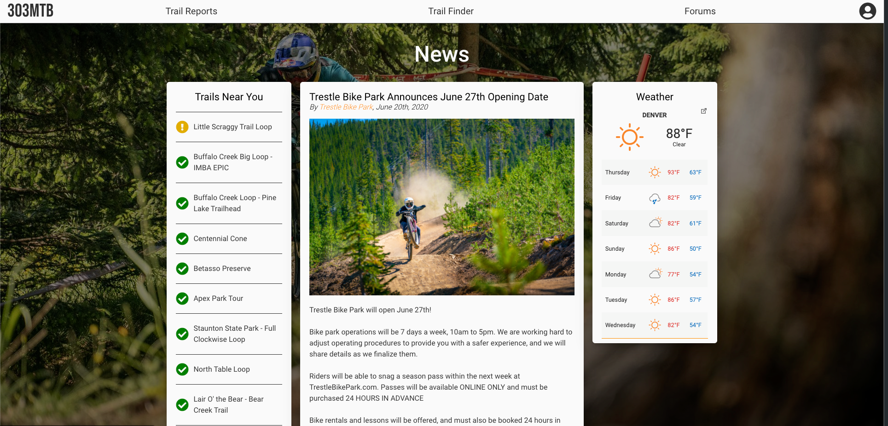
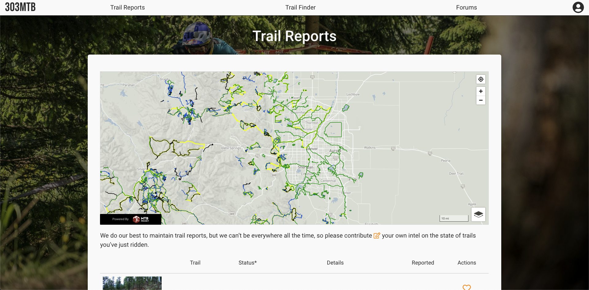
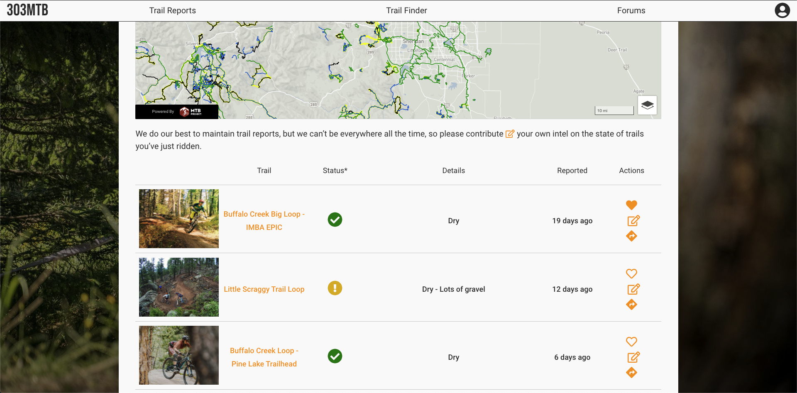
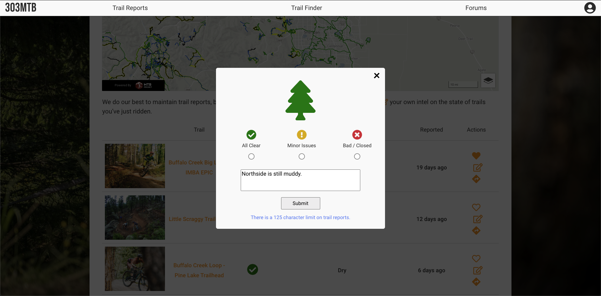

## 303MTB 🚵‍♂️
 
A Progressive Web Application which fosters an online community for mountain bikers in the Denver/Boulder area.

## Demo & Screenshots 🖥

Live Demo: www.303MTB.org

[Video Presentation for Flatiron School](https://youtu.be/znnAHKrnrC4)

 
## Features 🌟
- Users can quickly check conditions of trails nearest them
- Users can find in-depth information about trails in their area
- Users can leave trail reports and save favorite trails, favorite trails will always be at the top of user’s list
- Users can browse interactive trail maps to find new trails near them
- Users can browse local mountain biking press releases
- Users receive a seven-day forecast of their local weather
 
Currently under construction and open to collaboration:
- Users can receive a new trail recommendation based on user-submitted criteria
- Users can communicate with each other in a discourse community forum.

## Built with 🔧
- React
- Ruby on Rails
- REI Mountain Project API
- Heroku
- Firebase
- JWT Authentication

## Getting Started 👨‍🚀
1. Navigate to desired filepath for this app in terminal.
2. Fork (optional) and clone down the project by running the line below in terminal:

   `$ git clone git@github.com:m-delarosa/303MTB-fullstack-app-backend.git`

3. Install Gems in terminal using:

   `$ bundle install`

4. From repo root directory, start local server:

   `$ rails s`

Optional: Fork and clone the frontend [here.](https://github.com/m-delarosa/303MTB-react-frontend)

## Author, License and Contributions
MIT © [Michael De La Rosa](https://www.linkedin.com/in/mdelarosa/)

Contributions are always welcome!
